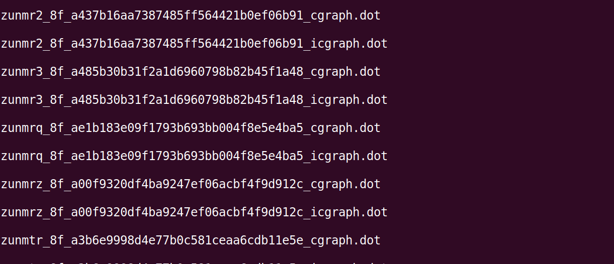
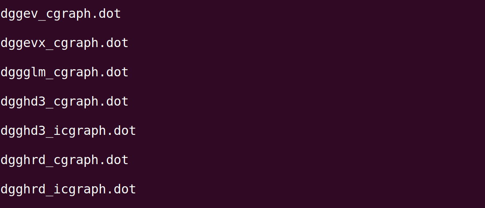
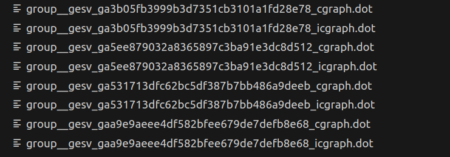
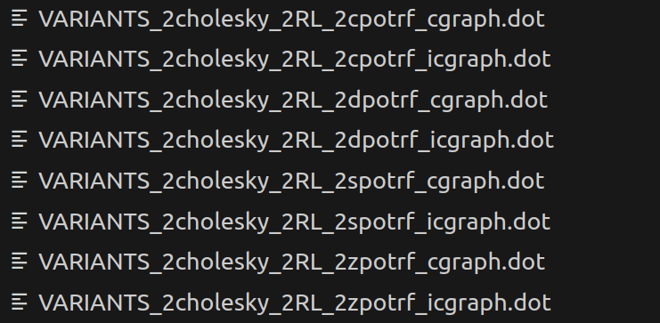
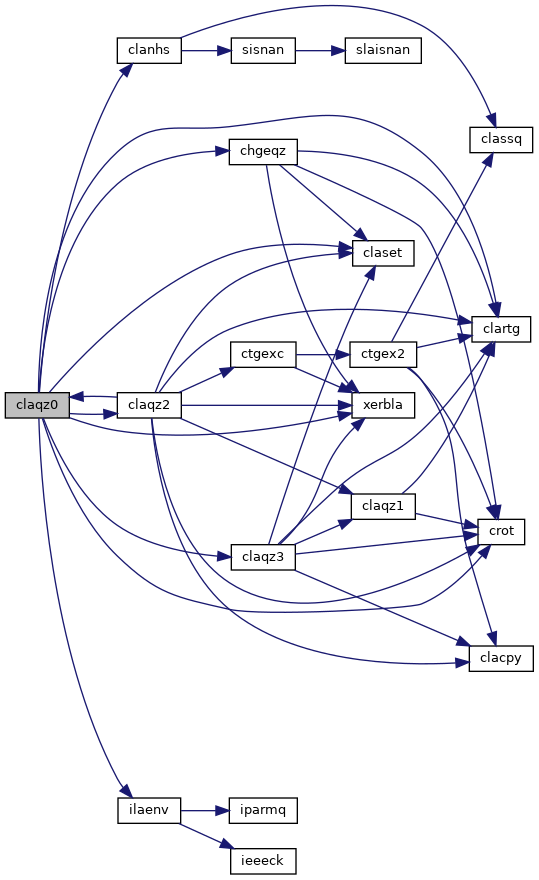
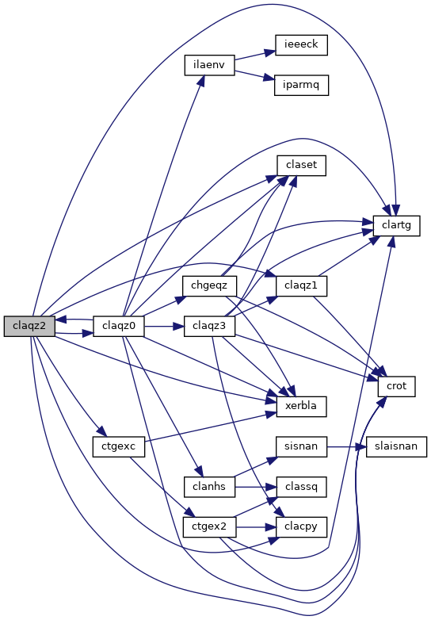

# Parsing the call graph of LAPACK routines

<div class="image" align="center">
        
    <br>
</div>

## The Problem

LAPACK is a massive library with over 1700 routines for solving systems of simultaneous linear equations, least-squares solutions of linear systems of equations, eigenvalue problems, and singular value problems for real and complex matrices in both single and double precision. A lot of these routines are dependent on each other which generates a large call graph. For the scope of this project we'll be implementing these routines from the ground up for the following reasons.

- stdlib follows a decomposable architecture where every package can be installed individually with little to no excess code which favours the web environment by reducing bundle sizes.
- We want to support `row-major` (C-style) and `column-major` (fortran-style) arrays for two dimensional matrices.
- We want to extend the functionality of these routines to support positive strides, negative strides and offsets.
- LAPACK takes a different routine to testing their routines than what we do. LAPACK takes a top down approach to test their routines. i.e. they'll test a higher level routine to ensure that the related lower level deps are working as expected, For example `dchkaa`. We at stdlib prefer to test each individual routine and support our algorithms with benchmarks, examples and documentation.

In such a massive library, finding a starting point is quite puzzling. This is the problem that I've tried to solve here!

## The Solution

In the massive call graph of LAPACK routines, we ideally want to start with the routines that don't have any dependencies i.e. the leaves of the call graph! These lower-level routines will serve as stepping stones towards more general-purpose, higher-level routines. For the scope of my application, I'll be focusing on a few selected lower-level routines to lay the groundwork for other contributors and my own efforts in this area to continue smoothly past the coding period of Google Summer of Code. For this, I parsed the LAPACK source code and generated a call graph which was stored as an adjacency matrix in JSON format. Once I had the graph, I ran a topological sort to identify the routines which had no dependencies. The output of this sorting would help us determine in what order to implement these routines so that we don't get blocked because of a dependency not being implemented when trying to write a particular routine.

While doing the topological sort I encountered another problem, for the topological sorting to work the call graph should be directed and acyclic in nature. This wasn't the case in LAPACK's source code, there are some routines which are dependent on each other and my initial attempt at the topological sort failed for this reason. Keep reading to find out how I tackled this problem!!

## The Process

I took the following steps to get the output array after running the topological sort:


1. ### Get LAPACK source code:

```bash
$ git clone https://github.com/Reference-LAPACK/lapack.git
```

2. ### Install Doxygen and Graphviz: 

    Doxygen is a widely-used documentation generator tool in software development. This is also what LAPACK uses to generate their documentation site! We'll be using this to generate the HTML files for documentation of LAPACK source code, we can get rid of it later our main purpose is to preserve the .dot files generated by Doxygen for further use. Graphviz is open source graph visualization software, we'll use this to render the .dot files from Doxygen as an image.

```bash
sudo apt update
sudo apt install doxygen
sudo apt install graphviz
```


3. ### Write the Doxyfile:

    From the root directory of LAPACK source code run the command given below.

    This config recursively generates the .dot files and preserves them after the HTML for the documentation website is generated instead of deleting them.


```bash
cd SRC/

cat << EOF > Doxyfile
EXTRACT_ALL            = YES
RECURSIVE              = YES
HAVE_DOT               = YES
CALL_GRAPH             = YES
CALLER_GRAPH           = YES
DOT_CLEANUP            = NO
INPUT                  = .
MAX_DOT_GRAPH_DEPTH    = 0
EOF
```

4. ### Run doxygen to parse LAPACK source code:

    Run doxygen on the SRC/ directory to generate the `html` documentation with the .dot files for the graphs that we're looking for: 

```bash
doxygen Doxyfile && rm -rf latex/
```

5. ### Extract meaningful results in a separate directory:
    Extract all the graphs in a separate directory:

```bash
mkdir -p DepGraphs && find . -type f -name "*.dot" -exec mv {} DepGraphs/ \;
```

<br>

After this I ran a bunch of scripts from the `scripts/` directory of this repository to achive the desired output, I'll be describing what each of the script does below:

**1_rename.sh**: The file names in the DepGraphs directory were not in a very readable format, to work on these on a large number of these files (2000+) I needed to bring some uniformity to the file names so that I could further operate on them with bash scripts in an efficient manner.

Here the `_icgraph.dot` is file will go on to generate the **Caller Graph** for a routine and `_cgraph.dot` will be responsible for the **Call Graph** of a routine.

<div class="image" align="center">
        
        <br>
</div>
<div align="center">
    <p>Original file names before running the rename script.</p>
    <br>
</div>
<div class="image" align="center">
        
        <br>
</div>
<div align="center">
    <p>Final file names after running the rename script.</p>
    <br>
</div>

The file names for some of the `.dot` files did not match the regex pattern so I renamed these manually by observing which routine is the file referring to.

<div class="image" align="center">
        
        <br>
</div>

I also moved the variants to a different folder before proceeding further, These can be found in `variants/VARIANTS_FOLDER`

<div class="image" align="center">
        
        <br>
</div>

**2_create_counterparts.sh**: This simply creates a corresponding empty `_crgaph.dot` or `_icgraph.dot` file for a routine if it doesn't exist. I did this just to maintain uniformity across a large number of routines.

**3_move_to_folder.sh**: This script moves the `_crgaph.dot` and `_icgraph.dot` file for every routine into a separate folder. 

**4_move_all_folders_to_src.sh**: This script moves all these folders to a `src` directory for better folder structure.

**5_create_img_dir.sh**: This script creates an `img/` directory in each of the folders present in `src` so that we can save the caller graphs and call graphs here.

**6_generate_graphs.sh**: This script uses `Graphviz` to generate the caller and call graphs for each routine and saves them in their respective `img` directories. For any routine in the `src/` directory, `img/dependencies.png` contains the caller graph and `img/dependents.png` contains the call graph.

**7_remove_double_underscores.sh** and **8_remove_double_underscore_from_filenames.sh** are just small utility scripts for better readablity and folder structure.

**9_direct_deps.py**: This script parses the `_cgraph.dot` files to capture the direct dependencies of each routine using a regex pattern and saves them as an adjacency matrix in `output/direct_deps.json`. If the file is empty (created while generating counterparts) the script returns an empty array for that routine. For example, if the script is ran on the file `src/cgbcon/cgbcon_cgraph.dot` the contents of which are mentioned below:

```
digraph "cgbcon"
{
 // LATEX_PDF_SIZE
  edge [fontname="Helvetica",fontsize="10",labelfontname="Helvetica",labelfontsize="10"];
  node [fontname="Helvetica",fontsize="10",shape=record];
  rankdir="LR";
  Node1 [label="cgbcon",height=0.2,width=0.4,color="black", fillcolor="grey75", style="filled", fontcolor="black",tooltip="CGBCON"];
  Node1 -> Node2 [color="midnightblue",fontsize="10",style="solid",fontname="Helvetica"];
  Node2 [label="clacn2",height=0.2,width=0.4,color="black", fillcolor="white", style="filled",URL="$clacn2_8f.html#ab908babe3ec3648412de15e0f8ab4479",tooltip="CLACN2 estimates the 1-norm of a square matrix, using reverse communication for evaluating matrix-vec..."];
  Node1 -> Node3 [color="midnightblue",fontsize="10",style="solid",fontname="Helvetica"];
  Node3 [label="clatbs",height=0.2,width=0.4,color="black", fillcolor="white", style="filled",URL="$clatbs_8f.html#a7d8bd104ed06bc225ed900431f530b70",tooltip="CLATBS solves a triangular banded system of equations."];
  Node3 -> Node4 [color="midnightblue",fontsize="10",style="solid",fontname="Helvetica"];
  Node4 [label="xerbla",height=0.2,width=0.4,color="black", fillcolor="white", style="filled",URL="$xerbla_8f.html#a377ee61015baf8dea7770b3a404b1c07",tooltip="XERBLA"];
  Node1 -> Node5 [color="midnightblue",fontsize="10",style="solid",fontname="Helvetica"];
  Node5 [label="csrscl",height=0.2,width=0.4,color="black", fillcolor="white", style="filled",URL="$csrscl_8f.html#a505a9b690770eee5797b3efdd8ce89a6",tooltip="CSRSCL multiplies a vector by the reciprocal of a real scalar."];
  Node1 -> Node4 [color="midnightblue",fontsize="10",style="solid",fontname="Helvetica"];
}
```

The output written in `output/direct_deps.json` is:

```json
"cgbcon": [
  "clacn2",
  "clatbs",
  "csrscl",
  "xerbla"
],
```

**10_routine_2_number_mapping.py** and **11_number_2_routine_mapping.py** simply sorts the routine names alphabetically and maps a unique numner to each of them so that we can represent our graph in numeric form and run the topological sort on them.

**12_direct_deps_numeric**: This script regenerates `output/direct_deps.json` in numeric format using the routine-to-number mapping we just created. Some routines did not have a `_cgraph.dot` and `_icgraph.dot` file for them so I've also logged them in `logs/missing.json` so that while implementing these routines we can refer to that for filling in any gaps. We have a directed call graph ready for all the LAPACK routines. We just have to merge the nodes to make the graph acyclic for the topological sorting to work!

**13_eliminate_cycles.py**: This script eliminates cycles from the Graph which is represented by `output/direct_deps_number_format.json` by merging the nodes which were a part of that cycle. for example in the routines `claqz0` and `claqz2`:

<div class="image" align="center">
        
        <br>
</div>
<div class="image" align="center">
        
        <br>
</div>
<div align="center">
    <p>Inter dependent routines claqz0 and claqz2.</p>
    <br>
</div>

So what was previously represented as:

```json
// ...other nodes

"claqz0": [
  "chgeqz",
  "clanhs",
  "claqz2",
  "claqz3",
  "clartg",
  "claset",
  "crot",
  "ilaenv",
],

// ...other nodes

"claqz2": [
  "clacpy",
  "claqz0",
  "claqz1",
  "clartg",
  "claset",
  "crot",
  "ctgexc",
],
```

is now represented as:

```json
"claqz0": [
  "chgeqz",
  "claqz1",
  "clanhs",
  "claqz2",
  "claqz3",
  "clartg",
  "claset",
  "ctgexc",
  "crot",
  "ilaenv",
]
```

And I've kept a record of these merged nodes so that we can revisit this at the time of implementation if we need to!

**14_run_toposort.js**: This script uses `@stdlib/utils-compact-adjacency-matrix` to run the topological sort and save the output in `output/WORKING_ORDER.json`.

**15_separate_routines.py**: This script separates routines from `output/WORKING_ORDER.json` into different files based on whether they operate on real or complex matrices and support double or single precision.

<br>

It must be noted that implementing these routines from scratch has to be a sustainable long term effort rather than a short term project. I hope that my efforts will provide a long term plan for implementing LAPACK routines in `stdlib`!